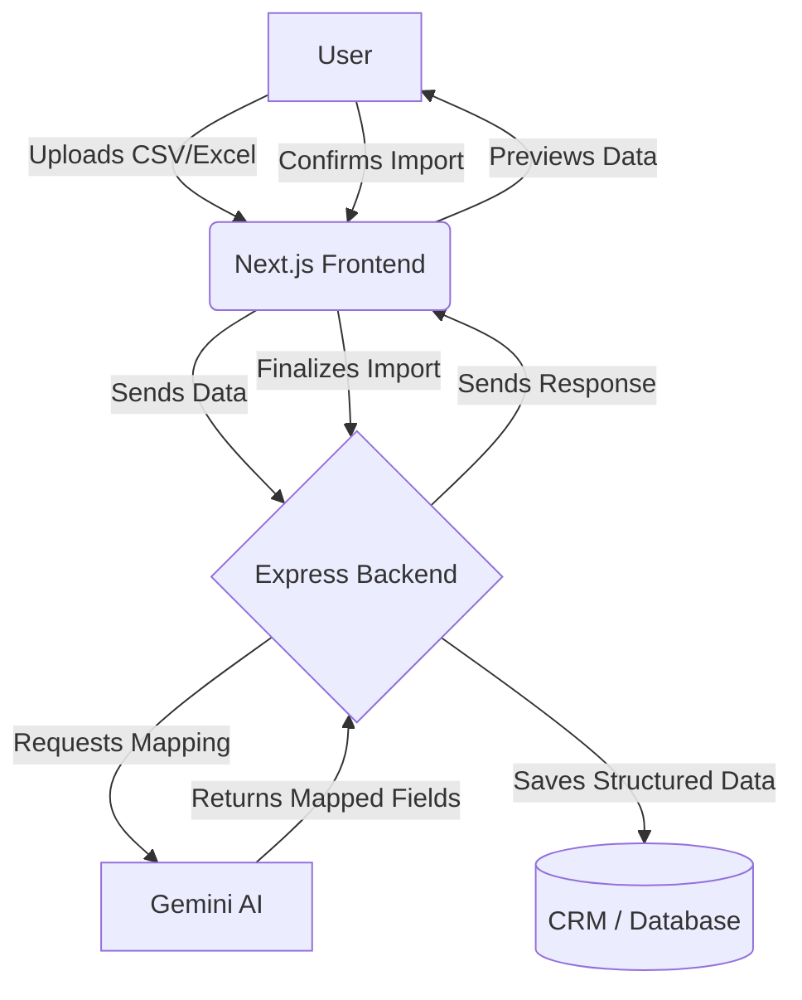

# 🚀 AI CSV Importer

<div align="center">
  <p>An AI-powered CSV & Excel Importer that intelligently maps uploaded file columns to CRM fields using Google's Gemini AI. Users can upload CSV or Excel files, preview AI-generated mappings, validate data, and import structured CRM-ready records with minimal manual effort.</p>
</div>

## 🌐 Demo

- **Live Frontend URL:** `https://ai-csv-importer-chi.vercel.app/`
- **Backend API URL:** `https://ai-csv-importer-t33w.onrender.com`

## 📸 Screenshots

`[Placeholder for Application Screenshot / GIF]`
*Add screenshots here demonstrating the upload process, AI mapping preview, and final import success.*

## ✨ Features

- **AI-Powered Mapping:** Intelligent column mapping using Google's Gemini AI.
- **Multiple File Formats:** Seamless support for both CSV and Excel (`.xlsx`) file uploads.
- **Automatic Header Detection:** Automatically identifies and extracts headers from uploaded files.
- **Data Preview:** Review AI-generated mappings and validate data before proceeding with the import.
- **Confidence Scores:** View AI mapping confidence scores to ensure accuracy.
- **Drag & Drop Interface:** Modern and intuitive drag-and-drop file upload experience.
- **Robust Validation:** Strict data validation using Zod schemas.
- **Error Handling:** Comprehensive error handling for both file parsing and API interactions.
- **Modern UI:** Responsive and visually appealing user interface built with modern standards.
- **Production-Ready:** Scalable architecture with separate frontend and backend deployments.

## 🛠️ Tech Stack

### Frontend


### Backend


### Deployment


## 🏗️ Architecture Flow

The application follows a clean, decoupled architecture:



1. **User** interacts with the modern UI to upload a file.
2. **Next.js Frontend** parses the file and sends the extracted headers/sample data to the backend.
3. **Express Backend** receives the request and communicates with the **Gemini AI API**.
4. **Gemini AI** intelligently maps the uploaded columns to the target CRM schema.
5. The **Backend** returns the mapped data alongside confidence scores to the frontend.
6. The **User** previews, adjusts if necessary, and confirms the import.

## 📂 Folder Structure

```text
ai-csv-importer/
├── frontend/             # Next.js application
│   ├── src/
│   │   ├── components/   # React components (Upload, Table, etc.)
│   │   ├── pages/        # Next.js routes
│   │   ├── styles/       # Tailwind & global CSS
│   │   └── utils/        # Helper functions
│   ├── package.json
│   └── ...
├── backend/              # Node.js / Express application
│   ├── src/
│   │   ├── controllers/  # Request handlers
│   │   ├── routes/       # API endpoints
│   │   ├── services/     # Business logic & Gemini AI integration
│   │   └── utils/        # Validation schemas & helpers
│   ├── package.json
│   └── ...
├── README.md
└── .gitignore
```

## 📋 Prerequisites

Before you begin, ensure you have the following installed and configured:

- **Node.js** (v20 or higher)
- **npm** (or yarn/pnpm)
- **Git**
- **Google Gemini API Key** (Get it from [Google AI Studio](https://aistudio.google.com/))

## 🚀 Complete Local Setup Guide

Follow these steps to get the project running locally.

### 1. Clone the Repository

```bash
git clone <repo-url>
cd ai-csv-importer
```

### 2. Backend Setup

Open a new terminal and navigate to the backend directory:

```bash
cd backend
```

Install dependencies:

```bash
npm install
```

Create a `.env` file in the `backend` directory and add your environment variables:

```env
PORT=5000
GEMINI_API_KEY=your_gemini_api_key_here
FRONTEND_URL=http://localhost:3000
```

Start the backend development server:

```bash
npm run dev
```
*(The backend should now be running on `http://localhost:5000`)*

### 3. Frontend Setup

Open another new terminal and navigate to the frontend directory:

```bash
cd frontend
```

Install dependencies:

```bash
npm install
```

Create a `.env.local` file in the `frontend` directory:

```env
NEXT_PUBLIC_API_URL=http://localhost:5000/api
```

Start the frontend development server:

```bash
npm run dev
```
*(The frontend should now be running on `http://localhost:3000`)*

### 4. Usage

1. Open `http://localhost:3000` in your browser.
2. Drag and drop a CSV or Excel file.
3. Review the AI-generated mappings.
4. Finalize the import!

---
<div align="center">
  <i>Built with ❤️ for modern data workflows.</i>
</div>
